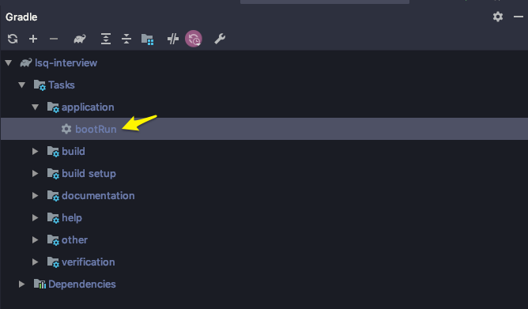
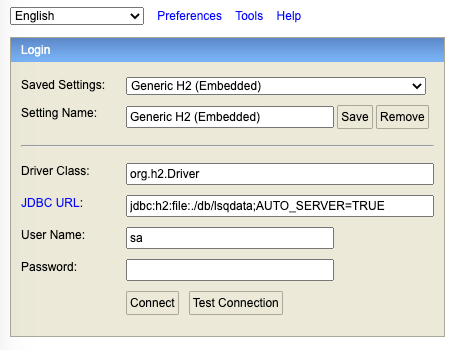

# lsq-interview

Welcome to the interview! This is a simple Spring Boot service which you will be modifying during your interview.

## Prerequisites

If you don't already have an IDE installed, we recommend IntelliJ.

1. Download and install [IntelliJ IDEA Community Edition](https://www.jetbrains.com/idea/download/)
2. Hit "Open or Import Project" and select this repo's folder to import the project.


If you would like to run the service with Docker, install
[Docker Desktop](https://www.docker.com/products/docker-desktop).

## Building and Running

### In IntelliJ

1. Open the Gradle view with `View -> Tool Windows -> Gradle`.
2. Find `lsq-interview -> Tasks -> application -> bootRun` and double-click it to launch.



### With Docker

```shell script
docker build -t lsq-interview . && docker run --rm -p 8080:8080 -v lsqinterviewdata:/app/db lsq-interview
```

### Without Docker

```shell script
./gradlew bootRun
```

## Uploading Invoices

The [csv](csv) directory contains test CSV invoice data and can be uploaded by running:

```shell script
curl -v -F file=@csv/invoice_data_1.csv localhost:8080/upload
```

Alternatively, there is a [Postman](https://www.postman.com/downloads/) collection in this repo that can be used to
make the request. To set it up:

1. Click the `Import` button in the top left corner of Postman.

2. Select the Postman collection JSON file in the root of this repo.

3. Find the `upload` request and change the file in the request body to this file included in the repo:
[./csv/invoice_data1.csv](./csv/invoice_data1.csv).

4. Hit `Send`.

## Database

To inspect the database and run queries, navigate to [http://localhost:8080/h2-console](http://localhost:8080/h2-console)
in a web browser. For JDBC URL, enter `jdbc:h2:file:./db/lsqdata;AUTO_SERVER=TRUE`. Leave everything else the same and hit connect.


